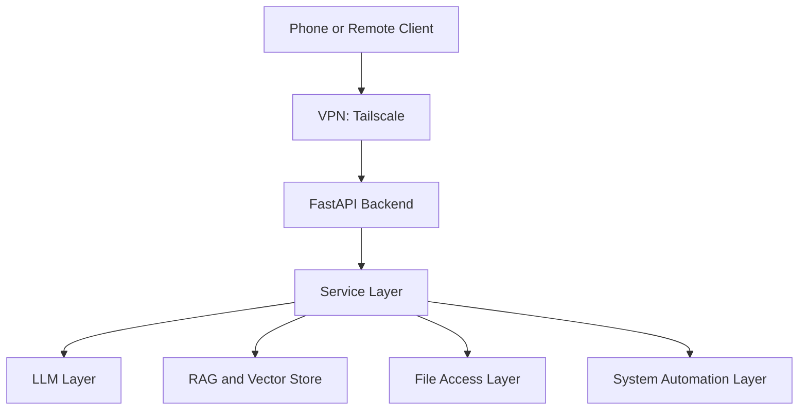

# Architecture

This document captures the system layout, layering boundaries, and future-ready design direction for Personal AI Server.

## High-Level Architecture



## Core Layers

### 1) Local LLM Layer
- Offline-capable inference path
- GPU optional
- Provider abstraction for model interchangeability

### 2) RAG Engine
- Local embeddings
- FAISS-backed vector search
- Ingestion and chunking pipeline
- Prompt context injection before generation

**Planned progression**
- Phase 1: structural correctness (persistence, metadata, safe reload)
- Phase 2: retrieval quality (normalization, hybrid search, reranking)
- Phase 3: system integration (router-aware triggers, telemetry)

### 3) File Access Layer
- Whitelisted-path access only
- Listing, search, summarization, and controlled download
- Validation before all filesystem operations

### 4) System Automation Layer
- Predefined safe actions only (shutdown/restart/backup-like tasks)
- No arbitrary shell command execution

### 5) Security and Access Layer
- JWT-based authentication model
- Multi-user compatible structure
- VPN-first exposure strategy (no public port forwarding required)

## Repository Structure (Conceptual)

```text
backend/
  api/        # Request/response endpoints
  app/        # Application wiring
  model/      # Model loading and wrappers
  services/   # Business logic and orchestration
  utils/      # Shared helpers
frontend/     # UI client
docs/         # Project documentation
```

## Design Principles

- Separation of concerns across layers
- Replaceable components behind stable interfaces
- Security-by-default for file and system actions
- Extensibility for future multi-user support

## Future Multi-User Direction

Potential data partitioning model:

```text
data/
  vector_store/{user_id}/
  documents/{user_id}/
```

This keeps retrieval and source documents scoped per user.
